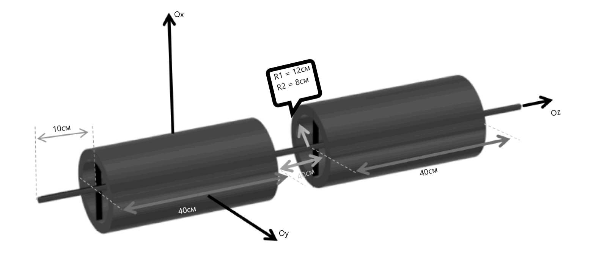

## Описание
Краткое описание проекта. Что он делает, для кого предназначен и какие проблемы решает.

Здравствуйте , это моя курсовая работа по теме : Трассировка пучка заряженных частиц в магнитном поле.
В данной работе рассмотрено движение пучка релятивистских частиц в электромагнитном поле - магнитном поле
создаваемом конфигурацией соленоидов. Решена задача о нахождении поля  соленоида в любой точке некоторой 
области пространства , а также найдены  траектории движения в данном поле каждой частицы из пучка. Результатом 
работы является компьютерная программа , способная произвести трассировку пучка электронов в магнитном поле , 
создаваемом соленоидами. 

## О программе
Пошаговая инструкция, как использовать и настроить проект.
Программа состоит из нескольких модулей :
- Расчёт интегралов магнитного поля от цилиндрического слоя
- Создание сетки этого поля
- Решение дифференцального уравнения из конфигурации двух соленоидов (можно сделать любую разумную конфигурацию)
- Произведение самой трассировки (графики траекторий от времени в 3D и 1D)

Клонируйте репозиторий:
   ```bash
   git clone https://github.com/ваш_логин/имя_репозитория.git
    ```

## Использование
Может быть использован для расчёта различных систем , представимых в виде совокупности цилиндрических слоёв
```markdown
## Использование
Примеры, как использовать проект.


